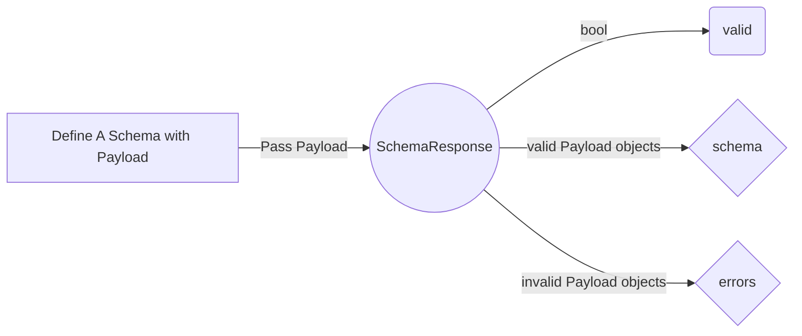

<h1 align="center">This is Activity</h1>  
<h4 align="center">A simple multiplatform State Manager that allows the full power of MVC with  
ZERO Packages. </h4>  

### Badge
Are you using this library on your app? You can use a badge to tell others, you can Add the following code to your README.md or to your website to help others find a quick way to start understanding activity.

<a title="Made with Activity" href="https://github.com/itskenzylimon/Activity">  
    
</a>  


## Platforms

| Platform     | Supported?                  |  
|----------    |----------------------------|  
| Web          | ✅ Tried & Tested              |  
| MacOS        | ✅ Tried & Tested              |  
| Windows      | ✅ Tried & Tested                            |  
| Linux        | ✅ Tried & Tested                   |  
| Android      | ✅ Tried & Tested                   |  
| iOS          | ✅ Tried & Tested                   |  

1. [Introduction to Activity](#introduction-to-activity)
2. [Getting Started with Activity](#getting-started-with-activity)
   1. [Add Activity dependency](#1-add-activity-dependency)
   2. [Create Controller](#2-create-controller)
   3. [Create View](#2-create-view)
   4. [Create Main Class](#2-create-main)
   5. [Simple Example](#5-simple-example)

3. [Data Types](#data-types)
   1. [Boolean](#bool)
   2. [DateTime](#datetime)
   3. [Double](#double)
   4. [Int](#int)
   5. [List](#list)
   6. [Map](#map)
   7. [Models](#models)
   8. [String](#strings)
   9. [Type any](#type-any)
4. [Helper functions](#database-migration)
   1. [String](#helper-string)
5. [Cool Color Logger](#cool-color-logger)
6. [Memory](#ActiveMemory)
7. [ActiveSockets](#)
8. [ActiveRequests](#)
9. [Taskan Crud Example](#taskan-crud-example)
10. [Features Request & Bug Reports](#features-request-&-bug-reports)
11. [Contributing](#contributing)
12. [Articles and videos](#articles-and-videos)

## Get Started

Open `pubspec.yaml` and add activity package to your dependencies

```yaml  
  dependencies:  
    activity: ^1.5.1+3  
```  

## Example app

A simple Crud based app using the Activity dependency.


### controller.dart

```dart  
import 'package:activity/activity.dart';  
  
class BaseController extends ActiveController {  
    
}  
```  

### view.dart

```dart  
import 'package:activity/activity.dart';  
  
class TaskView extends ActiveView<BaseController> {  
   const TaskView({super.key, required super.activeController});  
  
   @override  
   ActiveState<ActiveView<ActiveController>, BaseController> createActivity() =>  
           _TaskViewState(activeController);  
}  
  
class _TaskViewState extends ActiveState<TaskView, BaseController> {  
   _TaskViewState(super.activeController);  
  
   @override  
   Widget build(BuildContext context) {  
       
   }  
     
}  
```  

### main.dart

```dart  
  
void main() async {  
   WidgetsFlutterBinding.ensureInitialized();  
   runApp(const MyApp());  
}  
  
class MyApp extends StatelessWidget {  
   const MyApp({super.key});  
   @override  
   Widget build(BuildContext context) {  
      return MaterialApp(  
         title: 'Activity Task App',  
         theme: ThemeData(primarySwatch: Colors.blue),  
         home: Activity(  
            BaseController(),  
            onActivityStateChanged: ()=>  
                    DateTime.now().microsecondsSinceEpoch.toString(),  
            child: TaskView(  
               activeController: BaseController(),  
            ),  
         ),  
      );  
   }  
}  
  
```  

Activity allows developers to easily implement MVC architecture on there app, it doesn't get any  
harder than what you see, UI will rebuild the specified Widget automatically without stress giving  
you more time for implementation rather than spending countless hours working on your states.

## Global State Management

With Activity you can easily manage global states that affect the app across the apps cycle, states   
like settings configuration, user sessions and user / app data.

Create a MainController, you can place it at the root of the app

### controller.dart

```dart  
import 'package:activity/activity.dart';  
  
class MainController extends Controller {  
  
  /// This override is needed  
   @override  
   List<ActiveType> get activities {  
      return [];  
   }  
    
}  
```  

Change the `CupertinoApp` or `MaterialApp` to an `Activity` widget. you can optionally pass a   
unique identifier to track state id. NOTE: If you don't pass a unique identifier, Activity will  
use the current timestamp as the unique identifier.

### main.dart

```dart  
  
import 'package:example/controller.dart';  
import 'package:flutter/material.dart';  
import 'package:flutter/services.dart';  
import 'package:activity/activity.dart';  
  
import 'model.dart';  
  
void main() async {  
   WidgetsFlutterBinding.ensureInitialized();  
   runApp(const MyApp());  
}  
  
class MyApp extends StatelessWidget {  
   const MyApp({super.key});  
  
   @override  
   Widget build(BuildContext context) {  
      return MaterialApp(  
         title: 'Activity Task App',  
         theme: ThemeData(primarySwatch: Colors.blue),  
         home: Activity(  
            BaseController(),  
            onActivityStateChanged: () =>  
                    DateTime  
                            .now()  
                            .microsecondsSinceEpoch  
                            .toString(),  
            child: TaskView(  
               activeController: BaseController(),  
            ),  
         ),  
      );  
   }  
}  
  
class TaskView extends ActiveView<BaseController> {  
   const TaskView({super.key, required super.activeController});  
  
   @override  
   ActiveState<ActiveView<ActiveController>, BaseController> createActivity() =>  
           _TaskViewState(activeController);  
}  
  
class _TaskViewState extends ActiveState<TaskView, BaseController> {  
   _TaskViewState(super.activeController);  
  
   @override  
   void initState() {  
      // TODO: implement initState  
      super.initState();  
      activeController.initCalculations();  
   }  
  
   // @override  
   // void didChangeDependencies() {  
   //   Activity.getActivity<BaseController>(context).totalTaskLevels();  
   //   super.didChangeDependencies();  
   // }  
  
   @override  
   Widget build(BuildContext context) {  
      return MaterialApp(  
         debugShowCheckedModeBanner: true,  
         title: 'This is Activity',  
         theme: ThemeData(  
            primarySwatch: activeController.tasksLevel.value > 100 ? Colors.red : Colors.blue,  
            visualDensity: VisualDensity.adaptivePlatformDensity,  
         ),  
         home: Scaffold(  
            appBar: AppBar(  
               title: const Text('Activity App'),  
            ),  
            body: SafeArea(  
                    child: Column(  
                       children: [  
                          ifRunning(  
                                  const CircularProgressIndicator(),  
                                  otherwise: Expanded(  
                                          child: Align(  
                                             alignment: Alignment.topCenter,  
                                             child: ListView.builder(  
                                                itemCount: activeController.tasks.length,  
                                                itemBuilder: (context, i) {  
                                                   ActiveModel<Task> taskModel =  
                                                   activeController.tasks[i];  
                                                   return ListTile();  
                                                },  
                                             ),  
                                          ))  
                          )  
                       ],  
                    )),  
         ),  
      );  
   }  
}  
  
```  

Activity under the hood relies on Streams to track and update state in their respective widgets,

Apart from State Management, Activity can benefit a developer in many ways including

* Requires simplified development and code maintainability is easy .
* Apps built with Activity have incredibly less code lines.
* You have a wide variety of data types that extend to Activity, just by defining them  you don't really need to follow up on UI state.
* You get to write better logic and fast implementation in a Dart, Most developers   find it time-consuming tracking UI changes.
* Lastly but not the least, Activity allows developers to practice better  
  MVC architecture.

## Data Types

**Activity** will allow you to update your declared variables anywhere on the app code and rebuild the UI  for the affected widgets Only.

Active Data Types have a *typeName* and can be any key you assign the type to. It can really help when you want to update a value based on the assigned key *typeName*

#### ActiveBool
* ActiveBool : extends the dart bool data type, meaning you can enjoy the benefits  of the built in bool functions.

```dart 

/// Boolean  
/// The [typeName] can be any key you assign the type to.  
/// It can really help when you want to update a value based on the  
/// assigned [typeName]  
/// [ActiveBool] extends the dart bool, meaning you can enjoy the benefits  
/// of the built in bool functions  
/// [Activity] will allow you to update anywhere on the app code and rebuild UI  
/// for the affected widgets Only  
///  
ActiveBool activeBool = ActiveBool(false, typeName: 'keyFlag');  
  
/// [isTrue] flag checks if ActiveBool is true  
activeBool.isTrue;  
  
/// You can easily [reset] ActiveBool back to original value  
/// [notifyChange] flag allows you choose if you want the change  
/// to be updated on the affected widgets.  
activeBool.reset(notifyChange: true);  
  
/// You can do updates to a field using [set] func, this will do the update  
/// and do the ui rebuild on the affected widgets.  
/// passing [notifyChange] as false will not do a UI rebuild  
/// passing [setAsOriginal] as true will set the new value as  
/// the original value.  
activeBool.set(true, notifyChange: false, setAsOriginal: true);  
  
/// [setTrue] will set [ActiveBool] value to true  
activeBool.setTrue();  
  
/// [setFalse] will set [ActiveBool] value to false  
activeBool.setFalse();  
  
/// [value] will give you the current value  
activeBool.value;

``` 
#### ActiveDateTime
* ActiveDateTime : extends the DateTime data type, meaning you can enjoy the benefits  of the built in DateTime functions.

```dart 
/// DateTime  
/// The [typeName] can be any key you assign the type to.  
/// It can really help when you want to update a value based on the  
/// assigned [typeName]  
/// [ActiveDateTime] extends the dart bool, meaning you can enjoy the benefits  
/// of the built in DateTime functions  
/// [Activity] will allow you to update anywhere on the app code and rebuild UI  
/// for the affected widgets Only  
ActiveDateTime activeDateTime = ActiveDateTime(DateTime.now(), typeName: 'dateOfBirth');  
  
/// You can easily [setOriginalValueToCurrent] ActiveDateTime back to original value  
activeDateTime.setOriginalValueToCurrent();  
activeDateTime.reset(notifyChange: true);  
  
/// You can do updates to a field using [set] func, this will do the update  
/// and do the ui rebuild on the affected widgets.  
/// passing [notifyChange] as false will not do a UI rebuild  
/// passing [setAsOriginal] as true will set the new value as  
/// the original value.  
activeDateTime.set(DateTime.now().subtract(const Duration(days: 10)),   
 notifyChange: false, setAsOriginal: true);  
  
/// [value] will give you the current value  
activeDateTime.value;
``` 


#### ActiveDouble
* ActiveDouble : extends the dart Double data type, meaning you can enjoy the benefits  of the built in Double functions.

```dart 
/// Double  
/// The [typeName] can be any key you assign the type to.  
/// It can really help when you want to update a value based on the  
/// assigned [typeName]  
/// [ActiveDateTime] extends the dart bool, meaning you can enjoy the benefits  
/// of the built in DateTime functions  
/// [Activity] will allow you to update anywhere on the app code and rebuild UI  
/// for the affected widgets Only  
ActiveDouble activeDouble = ActiveDouble(1.5, typeName: 'rate'); // 1.5  
  
/// You can easily [setOriginalValueToCurrent] ActiveDateTime back to original value  
activeDouble.setOriginalValueToCurrent();  
activeDouble.reset(notifyChange: true);  
  
/// checks if the value is negative and returns a bool type  
activeDouble.isNegative;  
  
/// this converts a double to an int value  
activeDouble.toInt;  
  
/// this will add 0.5 to the current value and does the needed updates activeDouble.add(0.5); // 2.0  
  
/// this will subtract 1.0 to the current value and does the needed updates activeDouble.subtract(1.0); // 1.0  
  
/// this will divide 1.0 by 0.5 to the current value and does the needed updates activeDouble.divide(0.5); // 2.0  
  
/// this will multiply the value with 4 to the current value and does the needed updates  
activeDouble.multiply(4); // 8.0  
  
/// You can do updates to a field using [set] func, this will do the update  
/// and do the ui rebuild on the affected widgets.  
/// passing [notifyChange] as false will not do a UI rebuild  
/// passing [setAsOriginal] as true will set the new value as  
/// the original value.  
activeDouble.set(99.99,  
  notifyChange: false, setAsOriginal: true);  
  
/// [value] will give you the current value  
activeDouble.value;

``` 

#### ActiveInt
* ActiveInt : extends the dart Int data type, meaning you can enjoy the benefits  of the built in Int functions.

```dart 
/// INT  
/// The [typeName] can be any key you assign the type to.  
/// It can really help when you want to update a value based on the  
/// assigned [typeName]  
/// [ActiveDateTime] extends the dart int, meaning you can enjoy the benefits  
/// of the built in int functions  
/// [Activity] will allow you to update anywhere on the app code and rebuild UI  
/// for the affected widgets Only  
ActiveInt activeInt = ActiveInt(100, typeName: 'score'); // 1.5  
  
/// You can easily [setOriginalValueToCurrent] ActiveInt back to original value  
activeInt.setOriginalValueToCurrent();  
activeInt.reset(notifyChange: true);  
  
/// checks if the value is negative and returns a bool type  
activeInt.isNegative;  
  
/// checks if the value is positive and returns a bool type  
activeInt.isEven;  
  
/// increments the value by 1  
activeInt.increment();  
  
/// increments the value by 1  
activeInt.increment();  
  
/// this converts an int to double value  
activeInt.toDouble();  
  
/// this converts an int to a string value  
activeInt.toString();  
  
/// this will add 0.5 to the current value and does the needed updates  
activeInt.add(15); // 115  
  
/// this will subtract 10 to the current value and does the needed updates  
activeInt.subtract(10); // 95  
  
/// this will divide 1.0 by 0.5 to the current value and does the needed updates  
activeInt.divide(5); // 21  
  
/// this will multiply the value with 4 to the current value and does the needed updates  
activeInt.multiply(4); // 84  
  
/// You can do updates to a field using [set] func, this will do the update  
/// and do the ui rebuild on the affected widgets.  
/// passing [notifyChange] as false will not do a UI rebuild  
/// passing [setAsOriginal] as true will set the new value as  
/// the original value.  
activeInt.set(50,  
  notifyChange: false, setAsOriginal: true);  
  
/// [value] will give you the current value  
activeInt.value;
``` 

#### ActiveList
* ActiveList : extends the dart bool data type, meaning you can enjoy the benefits  of the built in List functions.

```dart 
/// List  
/// The [typeName] can be any key you assign the type to.  
/// It can really help when you want to update a value based on the  
/// assigned [typeName]  
/// [ActiveList] extends the dart bool, meaning you can enjoy the benefits  
/// of the built in List functions  
/// [Activity] will allow you to update anywhere on the app code and rebuild UI  
/// for the affected widgets Only  
ActiveList activeList = ActiveList([1,2,3], typeName: 'score'); // 1.5  
  
/// You can easily [setOriginalValueToCurrent] ActiveDateTime back to original value  
activeList.setOriginalValueToCurrent();  
activeList.reset(notifyChange: true);  
  
/// You can do updates to a field using [set] func, this will do the update  
/// and do the ui rebuild on the affected widgets.  
/// passing [notifyChange] as false will not do a UI rebuild  
/// passing [setAsOriginal] as true will set the new value as  
/// the original value.  
activeList.set([0,9,8],  
  notifyChange: false, setAsOriginal: true);  
  
/// [value] will give you the current value  
activeList.value;
``` 

#### ActiveMap
* ActiveMap : extends the dart bool data type, meaning you can enjoy the benefits  of the built in Map functions.

```dart 
/// Map  
/// The [typeName] can be any key you assign the type to.  
/// It can really help when you want to update a value based on the  
/// assigned [typeName]  
/// [ActiveMap] extends the dart bool, meaning you can enjoy the benefits  
/// of the built in Map functions  
/// [Activity] will allow you to update anywhere on the app code and rebuild UI  
/// for the affected widgets Only  
ActiveMap activeMap = ActiveMap({'key': 123}, typeName: 'score'); // 1.5  
  
/// You can easily [setOriginalValueToCurrent] ActiveDateTime back to original value  
activeMap.setOriginalValueToCurrent();  
activeMap.reset(notifyChange: true);  
  
/// You can do updates to a field using [set] func, this will do the update  
/// and do the ui rebuild on the affected widgets.  
/// passing [notifyChange] as false will not do a UI rebuild  
/// passing [setAsOriginal] as true will set the new value as  
/// the original value.  
activeMap.set({'key': 100},  
  notifyChange: false, setAsOriginal: true);  
  
/// [value] will give you the current value  
activeMap.value;
``` 

#### ActiveMemory
* ActiveMemory : extends the dart bool data type, meaning you can enjoy the benefits  of the built in Memory functions.

```dart 
Docs coming soon
``` 

#### ActiveModel
* ActiveModel : This is a user specified Model class, you can save a Model and have it reactive across the app cycle while enjoying the benefits that come with Model class.

```dart 
Docs coming soon
``` 

#### ActiveString
* ActiveString : extends the dart String data type, meaning you can enjoy the benefits  of the built in String functions.

```dart 
Docs coming soon
``` 

#### ActiveType
* ActiveType : This is a Type Any data data type, It supports any kind of data be it a Color, Widget, Map, Styles...

```dart 
Docs coming soon
``` 


## ActiveMemory

Active memory is meant to make data management of [activeTypes] fast and easy. You can easily get any type  of datatype (Int, Strings, Booleans, Doubles, Map, Models and T Any kind of data) from within any state of the app.

```dart  

/// initialise Memory instance
Memory memory = Memory.memory;  

/// you can easily check if any data is saved on memory
memory.isDataEmpty  
  
```  

```dart  
  
memory.readMemories(); // Returns a a list of all memories stored  
memory.readMemory('key'); // Returns the value of the key with its declared type  
memory.createMemory('key', value); // Creates an entry with the assigned value and key  
memory.upsertMemory('key', value); // Creates an entry and if the value exist it performs an upsert  
memory.updateMemory('key', value); // Performs an update on the key value   
memory.deleteMemory('key'); // Remove an entry from ActiveMemory  
memory.resetMemory(); // This resets all the entries on ActiveMemory  
memory.hasMemory(); // Checks if a key exists in ActiveMemory  
  
```  

## ActiveSockets

Activity allows you to connect with your severs using websocket easily, you can have full controll over the connection. ActiveSockets allows for easy integration between android/ios, windows/linux/macos and web.

```dart  

/// You can have as many WebSocket instance as you wish and
/// they wont let you down.

/// initialise an ActiveSocket instance
ActiveSocket activeSocket = WebSocket(); 

// create an activeSocket connection to a wss/ws endpoint
activeSocket.open('wss://demo.piesocket.com/v3/channel_123?api_key=VCXCEuvhGcBDP7XhiJJUDvR1e1D3eiVjgZ9VRiaV&notify_self');  

// onSuccess callback to alert you when a successfull connection is made
activeSocket.onSuccess(() {  
  print("onSuccess");  
});  

// onFailure callback to alert you when a failed connection is made
activeSocket.onFailure(() {  
  print("onFailure");  
});  

// onMessage callback to alert you on new messages and pass data from server
activeSocket.onMessage((data) {  
  print('onMessage @@@');  
  print(data);  
  if(data == 'Hello Activity'){  
  activeSocket.send('Hello world....');  
 }  print('onMessage');  
});  

// send function is used to send data to the channel you are connected to.
activeSocket.send('Hello world....'); 

// onClose callback used to alert you when a connection is closed.
activeSocket.onClose(() {  
  print('onClose');  
});
``` 

## ActiveRequests
Activity allows you to connect with your severs using HTTP Request easily, you can have full controll over the connection. ActiveRequests allows for easy integration between android/ios, windows/linux/macos and web.

```dart 

/// initialise an ActiveRequest instance
ActiveRequest activeRequest = ActiveRequest(); 

/// setup  activeRequest instance with your prefered configuration.
/// you can setup as many setups as you want for the different use
/// cases, like authenticationSetup where you want each request to
/// pass authorization hearders ( Bearer Token ) or have another
/// setup contain return type specifics, or have different 
/// baseURL. The use cases are as many as you want (i.e)

/// 1. int? idleTimeout = 1;  
/// 2. int? connectionTimeout = 1;  
/// 3. bool? logResponse = false;  
/// 4. bool? withTrustedRoots = false;  
/// 5. Map<String, String>? httpHeaders = {};  
/// 6. String? privateKeyPath = '';  
/// 7. String? schemePath = 'https';  
/// 8. String? baseURL = '';  
/// 9. String? privateKeyPassword = '';


/// Note you dont necessarily need to have a setUp to make a
/// request
activeRequest.setUp = RequestSetUp(  
  idleTimeout: 10,  
  connectionTimeout: 10,  
  logResponse: true,  
  withTrustedRoots: true,  
);  
  
/// ActiveResponse is returned once a request is made.
/// all request must return an ActiveResponse even if its a
/// network connection. ActiveResponse contains the following ie.

/// int statusCode;  
/// String endpoint = '';  
/// dynamic data;

ActiveResponse activeResponse = await activeRequest  
  .getApi(Params(endpoint: 'https://catfact.ninja/fact'));

/// Here we are passing 
/// 1. Map<String, String>? queryParameters = {}; ( Optional ) 
/// 2. String endpoint = ''; ( Required )

/// you can do the complete [getApi], [postApi], [putApi] and
/// [deleteApi] and still get a successful [activeResponse].

``` 

## Helpers

Helpers are function that performs part of the computation of another function .   
Activity has helper functions that make programing fun while making your code much easier to read
### String Helper

```dart  
import 'package:super_string/super_string.dart';  
  
void main() {  
    
  _value = 'ACTIVITY'.isUpperCase; /// => true  
  _value = 'activity'.isLowerCase; /// => true  
  _value = 'I_love activity'.toCamelCase(); /// => 'iLoveActivity'  
  _value = 'I love activity'.containsAll(['activity','love']); /// => true  
  _value = 'I love activity'.containsAny(['hello','activity']); /// => true  
  _value = 'I loVE ACTIVITY'.title(); /// => I Love Activity  
  _value = 'activity'.capitalize(); /// => Activity  
    
  _value = '123Activity'.isAlNum; /// => true  
  _value = 'Activity'.isAlpha; /// => true  
  _value = '111'.isInteger; /// => true  
  
  _value = 'activity'.count('i'); /// => 2  
  _value = 'Activity'.iterable; /// => ['A','c','t','i','v', 'i', 't', 'y']  
  _value = 'Activity'.first; /// => A  
  _value = 'Activity'.last; /// => y  
  _value = 'Activity'.charAt(0); /// => A  
  
}  
```  

## Activity Validation Setup:


**Activity** has a first-class support for object data validation, it works by defining a scheme with rules and assigning an object to [SchemaValidator.validate] for validation.

>  Just define the **validation schema** and validate your **object** against it.

**SchemaValidator** supports a number of data types like String, Numbers, bool, Date, Email and Phone validations, and apart from those, it also supports Max and Min checks with optional and mandatory fields.

```dart
/// This is the schema definition.  
/// Activity allows String, Numbers, bool, Date, Email and Phone validations  
/// apart from those activity also supports max and Min with optional and  
/// mandatory fields.  
var registerSchema = {
  
  "name": {  
  "type": String,  
  "required": true,  
  "min": 2,  
  "max": 20  
  },
    
  "email": {  
  "type": String,  
  "required": true,  
  "email": true,  
 },  

"phone": {  
  "type": String,  
  "required": true,  
  "phone": true,  
 },  

"birthdate": {  
  "type": String,  
  "required": true,  
  "date": true,  
 },  

"address": {  
  "type": String,  
  "required": true,  
  "min": 5,  
  "max": 100
}  
};
```

**SchemaValidator** returns a **SchemaResponse** response Model that contains the need fields for your next steps, be it, database insert or parsing to the server.
#####  Example Schema Response Model.
```dart
SchemaResponse({  
  required this.valid,// boolean, a flag for checking valididty
  required this.schema,// dynamic Object, returns validated entries
  required this.errors,// dynamic Object, returns error entries
});
```
#####  Custom Error Messages.

**SchemaValidator** also accepts passing your own **custom error messages**, this might help to make the responses a bit friendly than the generic ones.

```dart
/// You can pass your own [customErrorMessage] custom error messages to make  
/// the return errors more readable and friendlier.  
/// Keys have to match the ones on [Schema] and You [Object] Payload.  
var customErrorMessage = {  
  'name': 'Kindly Enter your Full Names',  
  'birthdate': 'Enter a valid date',  
};
```

In the bellow example we can see how easy it is to validate an object and get the right response to handle on your end, failed checks will still return a failed **SchemaResponse** with the specific errors and valid flag as false.

```dart
validateJSON(){  
  SchemaValidator schemaValidator = SchemaValidator(registerSchema);  
  // schemaValidator.customErrors = customErrorMessage;  
  
  SchemaResponse schemaResponse = schemaValidator.validate(sampleJSON);  
  if (schemaResponse.valid == false) {  
  printError(schemaResponse.toString());  
 } else {  
  printSuccess(schemaResponse.toString());  
 }}
 ```

#### Example Process Flow.



# Example Apps

- [Example App](https://github.com/itskenzylimon/Taskan/example)

> **ProTip:** You can use **Activity** with your prefered router package **It will still work**.

## Features Request & Bug Reports

Feature requests and bugs at the [issue tracker](https://github.com/itskenzylimon/Activity/issues).

## Contributing

Activity is an open source project, and thus contributions to this project are welcome - please feel free to [create a new issue](https://github.com/itskenzylimon/Taskan/issues/new/choose) if you encounter any problems, or [submit a pull request](https://github.com/itskenzylimon/Taskan/pulls). For community contribution guidelines, please review the [Code of Conduct](CODE_OF_CONDUCT.md).

If submitting a pull request, please ensure the following standards are met:

1) Code files must be well formatted (run `flutter format .`).

2) Tests must pass (run `flutter test`).  New test cases to validate your changes are highly recommended.

3) Implementations must not add any project dependencies.

4) Project must contain zero warnings. Running `flutter analyze` must return zero issues.

5) Ensure docstrings are kept up-to-date. New feature additions must include docstrings.


### Additional information

This package has **NO** dependencies.

Developed by:

© 2022 [Kenzy Limon](https://kenzylimon.com)

### Articles and videos

[Flutter Articles](https://medium.com/@itskenzylimon) - Medium Article

## Found this project useful? ❤️

If you found this project useful, then please consider giving it a ⭐️ on Github and sharing it with your friends via social media.


